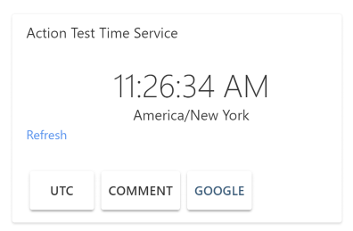

# time-test

This is a sample of a Now Assistant actionable card. The backend is provided by the [TestTimeService Connector](https://github.com/NowAssistant/TestTimeService).

The card can be used on the desktop and in all supported Bot Connetors (Slack, Spark, Amazona, ...)

